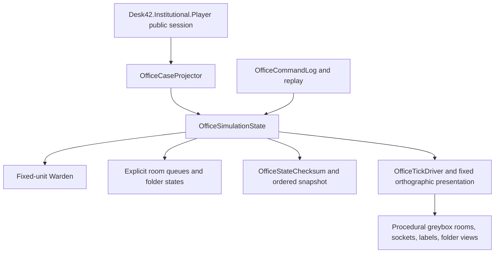

# Desk42 Office Slice v0.7 — M1 Greybox Closeout

## Result

- Final branch: `codex/office-slice-v0.7-m1-greybox`
- Final implementation state: M1-01 through M1-09 complete on the branch; the
  closeout commit is the commit that adds this report.
- Unity: `2022.3.62f3` (`96770f904ca7`)
- Product target: Windows x64 (`StandaloneWindows64`)
- M2: not started.

This is a deterministic, procedural greybox rather than a high-fidelity art
pass. The built player opens the existing institutional startup scene by
default; the explicit `--desk42-office-slice` launch flag routes a test or
development player to `OfficeSlice` without changing shipping startup order.

## Playable slice

The reviewer can load `OfficeSlice`, move the Warden through a fixed orthographic
three-quarter office using WASD/arrows or the Input System controller mapping,
buffer E/Space or south-face-button interactions, and see six public-safe cases
projected from `InstitutionalAutomationSession.Create(6)`. Six stable physical
folder views are driven by explicit logical queues and can be forced through
Front Desk → Paper Room → Money Room → Weird Room → Front Desk. Pause, single
step, command-log save, replay, checksum, route validation, Warden coordinates,
queue labels, and a deterministic force-route smoke action are available in the
Editor/development HUD.

## M1-01 through M1-09

| Milestone | Status | Evidence |
| --- | --- | --- |
| M1-01 branch and baseline | PASS | Required source head, clean branch creation, rollback tag `office-slice-m1-baseline-v0.5.1`, and [baseline note](OFFICE_SLICE_M1_BASELINE.md). |
| M1-02 scene/composition root | PASS | `OfficeSlice.unity` has exactly one root named `Office Slice Bootstrap`; Build Settings retain automation at index 0 and add OfficeSlice at index 1. |
| M1-03 deterministic clock | PASS | 30 TPS clock, bounded four-tick catch-up, pause/step, fixed-unit Warden state, and stable checksum. |
| M1-04 commands/replay | PASS | Versioned Move/Interact/Send/Decide log, tick/sequence ordering, validation failures, replay input lockout, JSON log output. |
| M1-05 Warden | PASS | Installed Input System keyboard/controller mappings, fixed integer sub-units, deterministic diagonal resolution, grid collision, stable interaction selection. |
| M1-06 camera | PASS | Fixed orthographic three-quarter camera; visible captures verified at 1600×900 and 1280×720. |
| M1-07 office grid | PASS | Explicit 32 px logical grid, five named rooms, interaction points, sockets, visible labels, and route validator. |
| M1-08 public cases | PASS | Six `OfficeCase` view models preserve AutomationClaimId, SourceCaseId, IssueId, DisplayId, issue label, urgency, schedule, public evidence needs, and parent/ruling markers. Product references only `Desk42.Institutional.Player` plus installed Input System. |
| M1-09 folders/queues | PASS | Separate logical folder state and presentation, stable ordered queues, deterministic tick transfers, pause-safe progress, single-owner validation, and complete six-folder route. |

## Architecture



Institutional public claims are read-only input to the product projection. The
Office Slice owns spatial state, commands, queues, and presentation. Unity
transforms are rebuilt from logical state and are not queue authority. No
Authority or Domain type is referenced by `Desk42.Product`.

## Validation evidence

All Unity commands used the existing CI-compatible environment overrides:

```powershell
$env:UNITY_MCP_KEEP_CONNECTED='false'
$env:UNITY_MCP_START_SERVER='false'
```

These overrides prevent the unchanged IvanMurzak MCP package from turning its
pre-existing authorization warning into a Unity test failure. No MCP provider
or package input was changed.

### EditMode

- New Office Slice deterministic suite: **9/9 passed** —
  `TestResults/M1/office-slice-editmode-rerun.xml`.
- Full standard EditMode suite after implementation: **427/427 passed, 0
  failed, 0 skipped** — `TestResults/M1/full-editmode-final.xml`.
- The 10,000-tick replay test passed in **three consecutive Unity process
  runs**, with three internal deterministic runs per test invocation:
  `determinism-run-1.xml`, `determinism-run-2.xml`, and `determinism-run-3.xml`.

Representative commands:

```powershell
Unity.exe -batchmode -nographics -projectPath . -runTests `
  -testPlatform EditMode `
  -testFilter Desk42.Tests.EditMode.OfficeSliceDeterminismTests `
  -testResults TestResults/M1/office-slice-editmode-rerun.xml

Unity.exe -batchmode -nographics -projectPath . -runTests `
  -testPlatform EditMode `
  -testResults TestResults/M1/full-editmode-final.xml
```

### PlayMode

- Office Slice scene boot/route suite: **2/2 passed** —
  `TestResults/M1/office-slice-playmode-final.xml`.
- Existing institutional automation PlayMode suite: **11/11 passed**, including
  `EightShiftRunEndsInDerivedBranchReview` —
  `TestResults/M1/automation-playmode-final.xml`.

```powershell
Unity.exe -batchmode -nographics -projectPath . -runTests `
  -testPlatform PlayMode `
  -testFilter Desk42.Tests.PlayMode.OfficeSlicePlayModeTests `
  -testResults TestResults/M1/office-slice-playmode-final.xml

Unity.exe -batchmode -nographics -projectPath . -runTests `
  -testPlatform PlayMode `
  -testFilter Desk42.Tests.PlayMode.InstitutionalAutomationPlayModeTests `
  -testResults TestResults/M1/automation-playmode-final.xml
```

The unrelated combined `CausalLegibilitySlicePlayModeTests` still report their
baseline two scene-build-setting failures because `InstitutionalProduct` was
not in Build Settings before M1 and the brief forbids unrelated build
configuration changes. The existing automation suite and the new Office Slice
suite are green.

### Build and runtime smoke

- Windows x64 build: **passed** — `Builds/M1/Desk42.exe`.
- Final build log: `TestResults/M1/windows-build-final.log`.
- Built-player route and capture logs report `OFFICE_SLICE_CAPTURE_OK` with no
  Office Slice exception.
- Capture matrix, visually inspected:
  - [1600×900 greybox capture](../../TestResults/M1/captures/office-slice-visible-1600x900.png)
  - [1280×720 greybox capture](../../TestResults/M1/captures/office-slice-visible-1280x720.png)

The capture launch used the built player, `--desk42-office-slice`,
`--desk42-office-slice-capture`, and
`--desk42-office-slice-capture-distribution`. Both visible captures show the
five-room floor, six folders, Warden, sockets, interaction points, and labels.

## Static and protected-path audit

- `git diff --check`: required before closeout.
- No files under the frozen institutional scripts, institutional automation
  scene, constitution, or protected product docs were changed.
- `Desk42.Product.asmdef` has no Authority or Domain reference.
- `Packages/manifest.json` and `Packages/packages-lock.json` were not changed.
- `Assets/_Project/Scenes/InstitutionalAutomation.unity` remains unchanged and
  remains Build Settings scene 0.
- No save schema, `AutomationFlowRuntime`, render-pipeline setting, or MCP
  provider was changed.

## Known limitations and M2 recommendation

- Send and Decide receivers are deliberately M1 stubs; room work, doctrine,
  customer anomalies, staff AI, dialogue, final UI, and persistence integration
  remain deferred.
- The folder distribution capture is a deterministic smoke arrangement, not a
  finished interaction UX.
- The procedural labels and room colors are greybox readability aids; the
  camera and queue layout need a visual target pass later.
- The normal non-development build uses the explicit office-slice launch flag;
  M1 does not change the default institutional startup scene.

Recommendation: **GO to M2 planning/review only**, after review of the known
limitations above. M2 execution was not begun in this milestone.

ComfyUI, Blender, FMOD, commissioned assets, final art, final sprites, and
audio production were not used.
