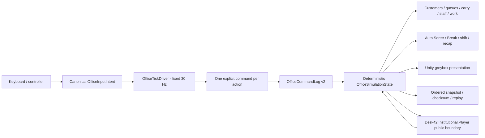

# Desk42 Office Slice v0.7 - M2 Core Loop Closeout

## Status

**M2 TECHNICAL PASS / CORE LOOP NOT PROVEN**

The four implementation gates and the automated technical gate pass. The required
six-person naive-player gate has not been run, so this milestone is explicitly not
claimed as fun, commercially validated, or design-proven. M3 has not begun.

## Source

- Branch: `codex/office-slice-v0.7-m2-core-loop`
- Required source commit: `cb154ea8d9e89a19c30d232d0f5b3ed97ddd072b`
- Validated implementation commit: `535db6593927a39b1936f1b833474aeff87b0750`
- Gate A: `598fa97` (`feat: implement m2 gate a manual case`)
- Gate B: `06c78f2` (`feat: implement m2 gate b staff and pressure`)
- Gate C: `b59e366` (`feat: implement m2 gate c automation break`)
- Gate D: `45e8775` (`feat: implement m2 gate d shift recap`)
- Runtime hardening/evidence probe: `535db65` (`perf: harden m2 simulation runtime`)

The final branch-tip hash that contains this closeout is recorded in the delivery
handoff. A Git commit cannot embed its own final object hash in its contents.

## Changed-file summary

Relative to the required source commit, the validated implementation changes 27
files: 4,721 insertions and 52 deletions.

- Product runtime: command schema/input intent, logical queues and carry state,
  deterministic customer/manual-work/staff/pressure/automation/break/shift state,
  simulation/checksum/replay integration, and procedural Unity presentation.
- Tests: four EditMode gate fixtures, M1 determinism compatibility coverage, and
  the Office Slice PlayMode critical-path suite.
- New M2 runtime owners: `OfficeCustomerState`, `OfficeStaffState`,
  `OfficeCarryState`, `OfficeManualTaskState`, `OfficeRoomWorkState`,
  `OfficeAutomationRuleState`, `OfficeBreakState`, `OfficeShiftState`, and
  `OfficeCausalEventLog`.
- No package, render-pipeline, protected Institutional, or protected scene file
  was changed.

## Requirement result

| Requirement | Result | Evidence summary |
|---|---|---|
| M2-01 Customer arrival/front desk | Pass | Six stable named customers; deterministic arrival/queue; one active desk customer; first case starts without debug input. |
| M2-02 Carry and Send | Pass | Single logical owner, one carried folder, explicit Send destination, invalid sends preserve ownership, carry included in replay/checksum. |
| M2-03 Paper Check/Compare | Pass | In-world fixed three-entry Compare, deterministic correct/incorrect result, cancellation-safe ownership. |
| M2-04 Money Trace | Pass | Fixed three-node route choices, deterministic path result, public evidence returned to Decide. |
| M2-05 Help | Pass | 90-tick channel, deterministic +2 work bonus, movement/target/cancel interruption. |
| M2-06 Pressure and Calm | Pass | Authored causes only; visible mood sequence; 60-tick Calm with 90-tick cooldown. |
| M2-07 Runner and Talker | Pass | Exactly two deterministic roles, integer pathing, visible intent, recoverable blocked work, no teleport authority. |
| M2-08A Decide adapter | Pass | Explicit `HELP CUSTOMER`/`REJECT CASE` mapping; explicit Narrow/no-procedure defaults; public Player API commit exactly once. |
| M2-09 Auto Sorter | Pass | One player-controlled public-data rule; reason logged; two known cases clear before the edge case. |
| M2-10 Self-copying-file Break | Pass | Exact authored conjunction, bounded copy lineage, five required recovery actions, two valid recovery orders. |
| M2-11 Shift state machine | Pass | Briefing through Result uses deterministic state; success/failure/restart covered; production critical path uses normal controls. |
| M2-12 WHAT HAPPENED recap | Pass | Observable-only causal chain records rule teaching, copied match, machine send, room fill, machine stop, and original recovery. |

## Architecture



Device polling is presentation-side input. The tick driver turns the latest
canonical intent into at most one movement command per 30 Hz simulation tick and
tick-buffered actions. Unity transforms do not own gameplay state. The Decide
adapter consumes and returns only public Player-boundary values.

## Automated evidence

All final evidence below was produced from implementation commit
`535db6593927a39b1936f1b833474aeff87b0750` with Unity `2022.3.62f3` and the
CI-compatible MCP connection overrides disabled for batch execution.

| Run | Result | Duration | Evidence |
|---|---:|---:|---|
| Full standard EditMode | 452/452 passed, 0 failed, 0 skipped | 12.4276544 s | `TestResults/M2/Final/full-editmode.xml` |
| Office Slice PlayMode | 11/11 passed, 0 failed, 0 skipped | 4.6337213 s | `TestResults/M2/Final/office-playmode.xml` |
| Institutional Automation PlayMode | 11/11 passed, 0 failed, 0 skipped | 37.9698917 s | `TestResults/M2/Final/institutional-automation-playmode.xml` |

The Office Slice PlayMode total includes all nine minimum named M2 tests plus two
M1 scene/ownership regressions.

### M1 and replay regression

- `M1InputDeterminism_RemainsGreen`: passed. Identical held input sampled at
  simulated 30, 60, and 144 render FPS produced the same command log, Warden
  position, and checksum.
- `InputGeneratorQueuesAtMostOneWardenMovePerTick`: passed.
- Keyboard/gamepad equivalence and single-fire buffered interaction remain in the
  full EditMode pass.
- `TenThousandTickReplay_RemainsGreen`: passed in 0.202809 s.
- Full M2 shift replay checksum: `6D95C9ACE2B200FC`, identical on original and
  replayed command streams.

## Windows build and built-player smoke

- Target: Windows x64.
- Build result: Unity process exit 0; log states `Build Finished, Result: Success.`
- Executable: `Builds/M2/Desk42.exe` (666,624 bytes).
- Executable SHA-256: `F5F73D8616A2500E0FB0223D83774E2D7F6A74C1BBDAD772F4FEFC9BF5812036`.
- Capture smoke at 1600x900: player exit 0 and `OFFICE_SLICE_CAPTURE_OK`.
- Capture smoke at 1280x720: player exit 0 and `OFFICE_SLICE_CAPTURE_OK`.
- Captures were visually inspected after generation. The HUD, first customer,
  folder queue, staff, rooms, Auto Sorter, and Copy Echo machine are visible at
  both resolutions without viewport cropping. Initial hidden-window captures were
  black and were discarded; the listed captures are the corrected visible-window
  output.

Capture paths:

- `TestResults/M2/Final/captures/office-slice-1600x900.png`
- `TestResults/M2/Final/captures/office-slice-1280x720.png`

Build and smoke logs:

- `TestResults/M2/Final/windows-build.log`
- `TestResults/M2/Final/built-smoke-1600x900.log`
- `TestResults/M2/Final/built-smoke-1280x720.log`

## Performance floor

Method: the built Windows player ran visibly at 1600x900 on the existing
development machine. The probe disabled VSync, requested 120 render FPS, warmed
up for 60 frames, then measured 600 rendered frames with a monotonic stopwatch.
This is a local greybox measurement, not target-hardware certification.

| Metric | Result |
|---|---:|
| Sample duration | 5.112826 s |
| Average render rate | 117.35 FPS |
| Worst sampled frame | 28.15 ms |
| Simulation ticks reported, including warmup | 174 |
| 60 FPS average target | Met |

Evidence: `TestResults/M2/Final/performance-1600x900.txt` and
`TestResults/M2/Final/performance-1600x900.log`.

The simulation cadence remains fixed at 30 Hz. A source audit removed recurring
read-only-wrapper creation from command, queue, case, and failure-list accessors;
no unbounded per-tick collection growth was found. This was a code-path audit,
not a Unity allocation-profiler capture. Restart duplication is covered by
`FailureRestartReturnsToCleanCheckpoint`; logical ownership is covered in both
EditMode and PlayMode. The scene owns no persistent worker thread or global event
subscription, so no hidden background worker remains after unload.

## Protected-path audit

The following command scope produced no changed paths between the required source
commit and validated implementation commit:

```text
git diff --name-only cb154ea8d9e89a19c30d232d0f5b3ed97ddd072b..535db6593927a39b1936f1b833474aeff87b0750 --
  Assets/_Project/Scripts/Institutional/Domain
  Assets/_Project/Scripts/Institutional/Authority
  Assets/_Project/Scripts/Institutional/Player
  Assets/_Project/Scripts/Institutional/Runtime
  Assets/_Project/Scenes/InstitutionalAutomation.unity
  DESK42_SYSTEM_CONSTITUTION.md
  Packages/manifest.json
  Packages/packages-lock.json
  ProjectSettings/GraphicsSettings.asset
  ProjectSettings/QualitySettings.asset
```

No package was added, the render pipeline was unchanged, and no ComfyUI, Blender,
FMOD, or final-art asset was used.

## Six-player naive-player gate

No human session was simulated or inferred from automated tests.

| Criterion | Required | Observed | Result |
|---|---:|---:|---|
| Start first case without verbal instruction | 5/6 | 0 sessions run | Not run |
| Complete Paper Check and Money Trace | 4/6 | 0 sessions run | Not run |
| Experience Auto Sorter as useful relief | 4/6 | 0 sessions run | Not run |
| State that the rule contributed to the Break | 4/6 | 0 sessions run | Not run |
| Recover or reach intended recoverable failure | 4/6 | 0 sessions run | Not run |
| Understand WHAT HAPPENED | 4/6 | 0 sessions run | Not run |
| Retry, choose another shift, or ask to continue | 4/6 | 0 sessions run | Not run |
| Need term explanation | No more than 2/6 | 0 sessions run | Not run |

## Known limitations and deferred scope

- First-time-player completion time and comprehension are not measured. The
  12-20 minute design budget is therefore not validated.
- Three cases have the bespoke M2 variation; the remaining named cases are
  readable/resolvable but their deeper linked narrative is deferred.
- Presentation is procedural greybox. Final art, music/audio, FMOD, full
  accessibility settings, campaign progression, office construction, additional
  staff/rules/Break families, and final save/load integration remain out of scope.
- Performance evidence is one local average/worst-frame sample, not a hardware
  matrix or profiler-based frame-time/allocation investigation.
- Human desirability, clarity, and replay intent are unknown until the gate runs.

## M3 recommendation

Do not begin M3 or visual-target production yet. First run the six-person
naive-player protocol without coaching, record behaviour before opinions, and
compare the observed counts with the locked thresholds. Proceed only if that gate
passes or after an explicit product decision that documents failed criteria and
the corrective M2 work.
